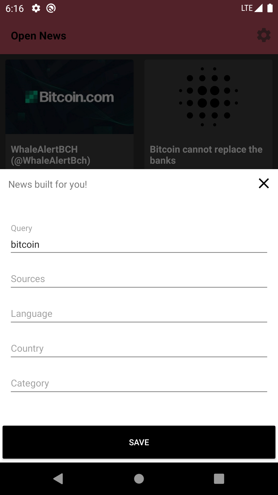

# open news

Android native app that fetches top headlines from **newsapi.**

### App: [download from Google Drive](https://drive.google.com/open?id=1bYp9-hvdfaI2_zOTwnpvz4GtQZiDbeyC)

# Architecture

- The app is built with `CLEAN` and `MVVM`.
- `':domain'` hosts the CLEAN codebase implementation
- `':app'` fecilitates `':domain'` with implementations of repositories,
which is then used in `ViewModel`s.
- The app is built for offline-first. So news once loaded is then available to be consumed offline.
  - `OfflineFirstRepository` is an abstraction that any repo can extend, enabling them to use an ensemble of local and network sources to fetch data.
  - The extending `repository` would provide its own implementation of `LocalSource` and `NetworkSource`.
  - `LocalSource` and `NetworkSource` enable polymorphic use in `OfflineFirstRepository`.
- `Dagger2`
  - `':app'` uses di throughout the module
- `RxJava2`
  - All repositories and use cases expose their data asynchronously using `Observable`s.

#### Good to haves
- Checkout [feature/imgcache](https://github.com/dhruvnagarajan/open-news/tree/feature/imgcache/app/src/main/java/data/persistence/bitmap) for custom image caching mechanism

# Design

News home page is built with `RecyclerView` and `CardView`, which show a vertical list of current top headlines.

Each news article opens up in a child activity sporting a full-screen webview to fetch article details.

While the website loads, its progress is shown to the user using a `BottomSheetDialogFragment`.

# Setup

Get an API key from newsapi.org and add OPENNEWSAPIKEY String field in appsecrets/local.properties.